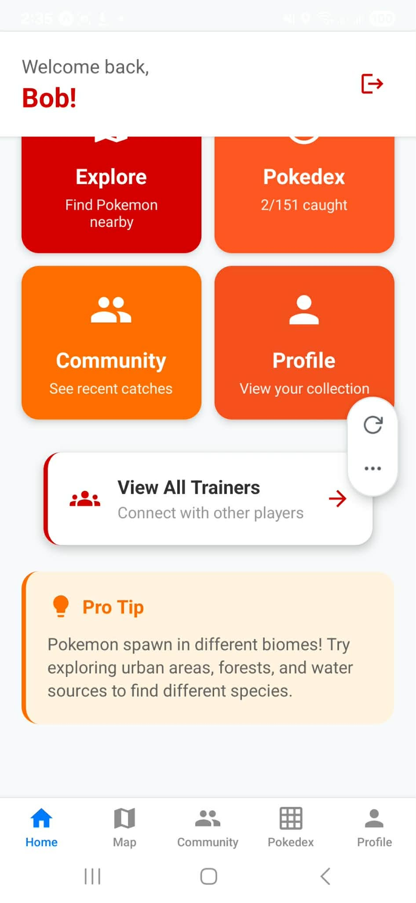
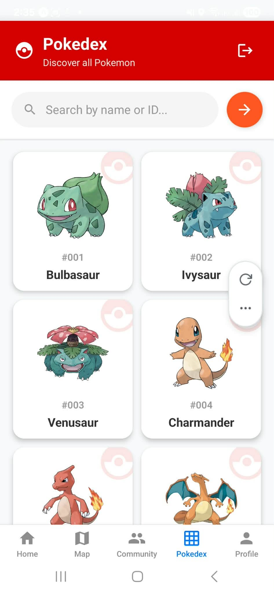
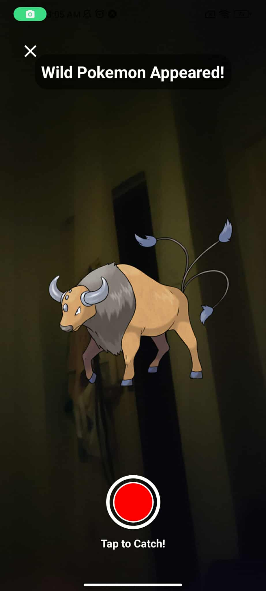
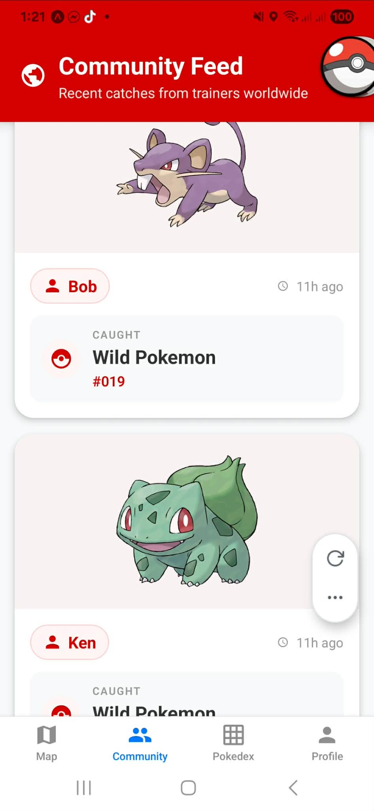

# PokeExplorerExpo 🌍

**PokeExplorerExpo** is a geolocation-based Augmented Reality (AR) game built with **React Native**. It is a full native Android application that interacts with device sensors, camera, and maps.

---

## 🚀 Key Features

### 🗺️ Geolocation & Map
*   **Real-World Biomes**: Procedurally generated biomes (Water, Urban, Forest) based on real coordinates.
*   **Hunt Mode**: Scan your surroundings using GPS to find hidden Pokemon.
*   **Legendary Radar**: Detect Legendary Pokemon from **200m** away.
*   **Unique Spawns**: Singleton Legendary encounters at real-world landmarks.

### 📸 AR Catch System
*   **Camera Integration**: Native camera feed for AR catching.
*   **Parallax Effect**: Gyroscope-enabled "breathing" animations.
*   **Voice Recognition**: Shout **"Gotcha!"** to trigger capture (Uses Native Microphone).

### 🎒 Progression
*   **Pokedex**: Stats and details database.
*   **Daily Quests & Badges**: Gamified achievements.

---

## App Screenshots

### Home Screen


### Map & Exploration


### AR Catching Mode


### Trainer Profile


### Community Features


---

## Technology Stack

*   **Core**: React Native (0.76)
*   **Language**: TypeScript
*   **Editor**: Android Studio (for Native Build)
*   **Modules**:
    *   `react-native-maps` (Google Maps)
    *   `@react-native-voice/voice` (Native Speech Recognition)
    *   `expo-av` (Audio System)
    *   `expo-camera` (Camera Access)
*   **Backend**: Firebase Firestore

---

## 📱 Build Instructions (Android Studio)

This project is a standard React Native app. It contains a native `android` directory that can be compiled with Gradle.

### Prerequisites
*   Node.js (v18+)
*   Java JDK 17
*   Android Studio

### How to Run

1.  **Install Dependencies**
    ```bash
    npm install
    ```

2.  **Generate Native Android Project**
    (This ensures the `android/` folder is up to date with all native modules)
    ```bash
    npx expo prebuild
    ```

3.  **Open in Android Studio**
    *   Open **Android Studio**.
    *   Select "Open an Existing Project".
    *   Navigate to `PokeExplorerExpo/android`.
    *   Click **Run** (Green Play Button) to build and launch the app on your emulator or device.

4.  **Alternative: Command Line**
    ```bash
    npm start
    # Press 'a' to build and run on Android
    ```

---